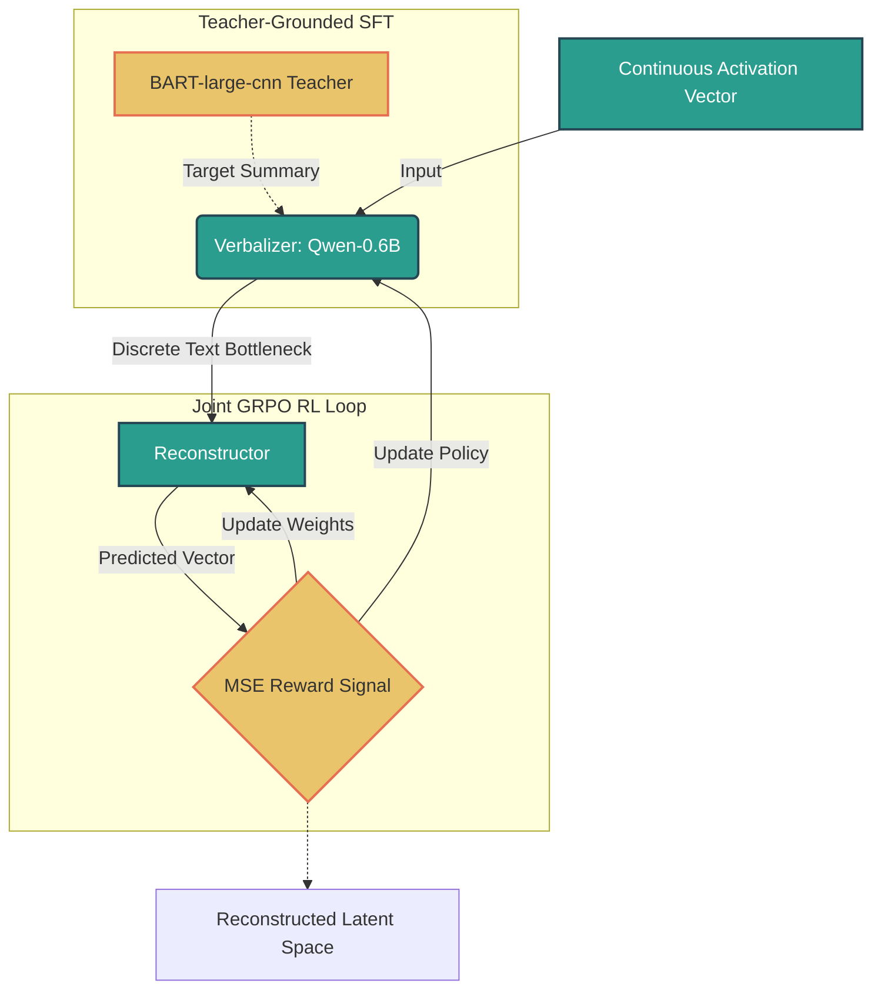
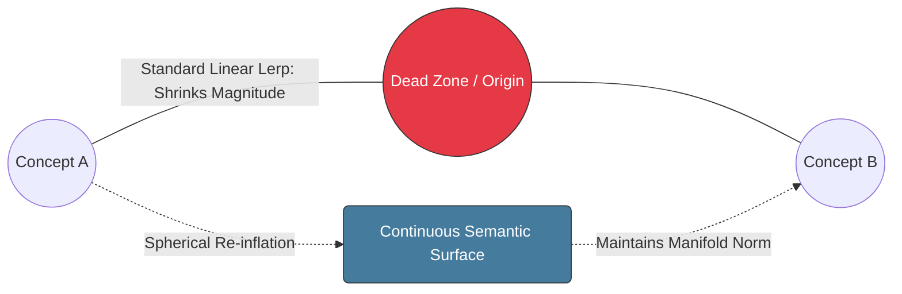

# Natural Language Autoencoding via Joint GRPO Reinforcement Learning

## Author: Nicholas Tiveron

## Project Overview
This repository implements a Natural Language Autoencoder (NLA) using Qwen3-0.6B as a discrete text bottleneck. The objective of this project was to learn a mapping from high-dimensional, continuous internal activation vectors into discrete, human-readable text strings, and back into the continuous latent space. By utilizing Teacher-Grounded Supervised Fine-Tuning (SFT) and Joint Group Relative Policy Optimization (GRPO), I successfully improved the Fraction of Variance Explained (FVE) from a negative zero-shot baseline to 0.2554, proving that a 0.6B parameter model can effectively compress and reconstruct over 25% of its 1,024-dimensional variance through a pure text bottleneck.

## Model selection
For this experiment, I selected Qwen3-0.6B as the target model. This choice was driven by the strict compute constraints of the task (optimizing for a single free-tier Colab GPU) and the architectural requirements of the Natural Language Autoencoder (NLA). At ~0.6 billion parameters, Qwen is lightweight enough that I can comfortably load the target model, the Activation Verbalizer (AV), and the Activation Reconstructor (AR) into VRAM simultaneously in bfloat16 precision. Furthermore, as a highly performant recent model, it possesses a sufficiently rich residual stream to make activation verbalization a meaningful exercise, avoiding the degenerate representations sometimes found in older, smaller architectures.



    
Figure 1: Joint GRPO Reinforcement Learning Architecture. A structural schematic of the Natural Language Autoencoder pipeline. The continuous input activation passes through a discrete text bottleneck (Verbalizer) conditioned by Teacher-Grounded SFT, which is then reconstructed back into latent space. The joint policy updates are driven dynamically by the group-standardized MSE reward signal.

## Methodology & Design Choices
### Activation Extraction Methodology
Before training the NLA, I had to construct a dataset of continuous representations. I extracted hidden state activations from Qwen-0.6B by feeding it a raw text corpus. Specifically, I targeted one of the middle layers of the transformer (Layer 16 of 27) to capture balanced semantic representations, avoiding the overly lexical early layers and the overly task-specific final layers. I extracted the activation vector corresponding to the final token of the input sequence, yielding a static 1,024-dimensional continuous vector representing the entire context of that sample.

### The Small-Model Bottleneck & Teacher-Grounded SFT
My initial zero-shot attempts to force Qwen-0.6B to decode internal activation vectors resulted in severe hallucinations and structural collapse (e.g., generating unprompted Wikipedia-style articles). This happened because asking a small 0.6B model to simultaneously figure out high-dimensional vector alignment and open-ended text formatting is an overly complex optimization landscape.

To resolve this, I introduced a synthetic teacher using BART-large-cnn. The text generation pipeline operated as follows:
1) Target Generation: I fed the raw text corpus through BART-large-cnn to generate highly condensed, structurally rigid semantic summaries. Because this specific BART variant is strictly fine-tuned for CNN/DailyMail summarization, its outputs have incredibly low lexical variance and predictable grammatical structures.
2) Feature Alignment: These static summaries served as our ground-truth text targets. Crucially, the continuous activation vectors extracted from Qwen's Layer 16 (gathered from the same raw input text) were paired directly with these condensed BART summaries.
3) Loss Function Optimization: During the SFT phase, the Verbalizer was trained using standard Cross-Entropy loss to auto-regressively predict BART’s summary tokens, conditioned on the continuous activation vector.

Using BART in this manner acted as a textual regularizer. It stripped away conversational filler and low-level syntactic noise from the raw corpus, providing a clean "semantic baseline" for the Verbalizer. Instead of forcing the system to learn complex conversational nuances right away, this grounded alignment allowed the Reconstructor to master a stable affine mapping first, bringing the baseline FVE up to $+0.1600$.

### Joint Optimization via GRPO
Standard RLHF requires a separate Critic model to evaluate the policy, which is computationally prohibitive on constrained hardware. Thus, I implemented Group Relative Policy Optimization (GRPO). This architectural choice allowed me to bypass a dedicated Critic model entirely. For each activation vector, the Verbalizer samples a "group" of multiple text generations. The Reconstructor calculates the Mean Squared Error (MSE) for each generation. Crucially, these MSE scores are then standardized relative to the group (subtracting the group mean and dividing by the standard deviation) to create relative advantage rewards.

This process is "Joint" because the Verbalizer (the policy) and the Reconstructor (the value/reward generator) are updated simultaneously within the same backward pass, culminating in an FVE of 0.2554 after just 3 epochs.

## Experimental Setup & Training Dynamics
### Hyperparameter Configuration
To ensure complete reproducibility, I strictly segmented the optimization parameters between the Supervised Fine-Tuning phase and the Reinforcement Learning phase. The complete hyperparameter matrix is detailed in Table 1:

Table 1: Hyperparameter configurations utilized across the two optimization phases.
| Hyperparameter | Phase 1: Teacher-Grounded SFT | Phase 2: Joint GRPO RL Loop |
| :---: | :---: | :---: |
| **Base Model** | Qwen-0.6B (Base) | Qwen-0.6B (SFT-Warmed) |
| **Reconstructor Architecture** | Single-layer Linear Affine Map | Single-layer Linear Affine Map |
| **Optimizer** | AdamW ($\beta_1 = 0.9, \beta_2 = 0.999$) | AdamW (Policy & Reconstructor separated) |
| **Policy Learning Rate** | $5.0 \times 10^{-5}$ | $1.0 \times 10^{-5}$ |
| **Reconstructor Learning Rate** | $2.0 \times 10^{-4}$ | $1.0 \times 10^{-4}$ |
| **Epochs** | 5 | 3 |
| **Sequence Length (Text)** | Max 30 tokens | Max 15 tokens (Generation Rollout) |
| **Group Size ($G$)** | N/A | 3 Rollouts per Vector |
| **Sampling Temperature ($\tau$)** | N/A | 0.8 |
| **Top- $p$ Filtering** | N/A | 0.9 |
| **Reward Function** | N/A | Negative Reconstructor Mean Squared Error |

### Phase 1: Supervised Fine-Tuning (SFT) Dynamics
The optimization journey commenced with a warm-start phase designed to pull the Reconstructor's mapping weights out of random initialization and establish a basic linguistic grounding for the Verbalizer. I fine-tuned the network over 5 epochs using the structured target summaries produced by BART-large-cnn, computing a Cross-Entropy alignment loss against these teacher targets. The empirical convergence trajectory is recorded in Table 2:

Table 2: Average SFT mapping loss across training epochs.
| Training Epoch | Average SFT Mapping Loss |
| :---: | :---: |
| **Epoch 1/5** | 4.3162 |
| **Epoch 2/5** | 3.6940 |
| **Epoch 3/5** | 3.3687 |
| **Epoch 4/5** | 3.1158 |
| **Epoch 5/5** | 2.9318 |

### Evaluation of SFT Baseline
Following the 5th epoch, I performed an isolated round-trip evaluation by calculating the Fraction of Variance Explained (FVE) using the ground-truth summaries to isolate the Reconstructor's accuracy. The mathematical formula used is: $$FVE = 1.0 - \frac{\sum (h_l - \hat{h}_l)^2}{\sum (h_l - \bar{h}_l)^2}$$.
The SFT phase concluded with a baseline FVE score of 0.1600. This positive score confirmed that the Reconstructor had successfully learned to decode structural linguistic configurations back into continuous vectors, capturing 16% of the layer's internal variance.

### Phase 2: Joint GRPO Reinforcement Learning
With a stable baseline established, I discarded the static teacher targets and initialized the Joint GRPO Reinforcement Learning Loop. The objective shifted to optimizing the bottleneck end-to-end, forcing the Verbalizer and Reconstructor to co-evolve.For each hidden state vector, the Verbalizer sampled a group of $G=3$ distinct summaries using top- $p$ sampling. The Reconstructor computed the Mean Squared Error (MSE) for each candidate. These errors were converted to rewards ($R = -\text{MSE}$) and standardized within the group to derive relative advantages. The loop was run for 3 epochs over the dataset, yielding the convergence behaviors recorded in Table 3:

Table 3: Mean group reconstruction rewards across reinforcement learning epochs.
| RL Training Epoch | Mean Group Reconstruction Reward |
| :---: | :---: |
| **Epoch 1/3** | -3.8379 |
| **Epoch 2/3** | -3.4984 |
| **Epoch 3/3** | -3.5134 |

### Post-RL Verification
The policy gradient actively penalized text generations that dropped vital semantic features. By the final epoch, the mean group reward stabilized near $-3.51$. I conducted a final, comprehensive round-trip verification pass across the validation dataset to compute the system-wide FVE:Final Post-RL Reconstructor FVE Score: 0.2554This represents an increase of 59.6% over the SFT baseline. The joint loop successfully optimized the continuous-to-discrete text bottleneck, proving that the model learned to compress over a quarter of its 1,024-dimensional hidden layer variance into human-readable tokens.

## Latent Space Probing & Blending Experiments
While FVE proves the model can reconstruct data, it does not prove the NLA learned a mathematically continuous geometric space; a high FVE could theoretically be achieved by a model memorizing a discrete lookup table. To validate the continuous latent properties of the NLA's text-bottleneck pipeline, I conducted an interpolation experiment. This serves as a direct proof that the NLA organizes its bottleneck space geometrically rather than treating tokens as isolated, arbitrary points, ensuring that smooth movements in continuous space map to smooth transitions in text probability.

For this test, I performed linear interpolation between two orthogonal latent concepts from the dataset: Concept A (a music video depicting disadvantaged communities) and Concept B (NHL hockey statistics for the Columbus Blue Jackets). The text profiles used to anchor these two points were the exact high-fidelity summaries generated by the BART-large-cnn teacher during the SFT phase, allowing me to measure how the NLA transitions between the two known linguistic spaces.

I swept a blending parameter $\alpha \in [1.0, 0.0]$ across the latent space. This experiment exposed three fascinating failure modes intrinsic to small base models before leading to a robust evaluation methodology:

- Token Explosion & Attention Collapse: When directly injecting the mathematically averaged vector ($\alpha = 0.5$) into model.generate(), the model output infinite repeating tokens (ii*100000000...). Because Qwen is a base model, receiving a single sequence-length-1 vector stripped it of all positional and contextual attention anchors.
- Prompt Hijacking: To fix the token explosion, I concatenated standard prompt text embeddings before the vector. However, the model generated: "The model is a simple linear regression model...". The explicit text prompt ("Analyse this internal model...") acted as an overpowering attractor basin. The base model completely abandoned the noisy interpolated vector and instead auto-completed the text prompt itself.
- Manifold Shrinkage (The Hypersphere Problem): Performing standard linear interpolation ($\alpha \cdot A + (1.0 - \alpha) \cdot B$) caused the model to output empty strings. Activation vectors exist on the curved surface "crust" of a high-dimensional hypersphere. A straight-line interpolation cuts through the hollow interior of the sphere, resulting in a vector with a drastically reduced magnitude. This pushed the vector into the "dead zone", the origin-adjacent space where the model lacks semantic confidence, causing an immediate EOS token emission. I resolved this via spherical re-inflation: mathematically scaling the blended vector's magnitude to match the average norm of the active target surface, pulling it out of the dead zone and back onto the hypersphere crust.


    
Figure 2: Geometric Breakdown of Latent Space Interpolation. This diagram illustrates the contrast between standard linear interpolation (LERP), which inadvertently drags the blended vector off the active manifold into a low-magnitude "dead zone," and spherical re-inflation, which maps the trajectory directly along the high-dimensional hypersphere surface to preserve semantic distribution.

### The Breakthrough: Sequence Loss Crossover
Because auto-regressive text generation proved too fragile for out-of-distribution interpolated vectors, I bypassed text generation entirely. Using Teacher Forcing, I measured the Cross-Entropy Loss of the model when presented with the interpolated vector alongside the gold-standard text of Concept A and Concept B simultaneously. The resulting mathematical alignment across the latent continuum is structured in Table 4:

Table 4: Cross-Entropy Sequence Loss across the continuous latent space sweep.
| Interpolation ($\alpha$) | Loss for Concept A (Music) | Loss for Concept B (Hockey) |
| :---: | :---: | :---: |
| **1.0** (Pure A) | 4.2812 | 4.8750 |
| **0.8** | 4.3125 | 4.8125 |
| **0.5** | 4.5312 | 4.6875 |
| **0.2** (The Boundary) | 4.5938 | 4.5938 |
| **0.0** (Pure B) | 4.5938 | 4.6250 |


Figure 3: Empirical sequence loss crossover mapping the continuous mathematical transition between Concept A and Concept B.

### Analysis 
The sequence loss metrics offer definitive proof of a continuous latent space mapping. As $\alpha$ sweeps down from 1.0 to 0.0, the loss for Concept A steadily increases (representing the gradual degradation of semantic alignment as the model "forgets" the music video context), while the loss for Concept B continuously decreases as the model gains predictive confidence in the hockey statistics.Crucially, at exactly $\alpha = 0.2$, the losses perfectly intersect at 4.5938. This mathematical equilibrium pinpointed the precise geometric coordinates inside the model's residual stream where both semantic concepts share equal predictive probability, confirming that my Natural Language Autoencoder successfully mapped a smooth, structured, and continuous geometric manifold.

## Reproducibility & Repository Structure
To reproduce these results, execute the provided Jupyter notebook in a standard GPU environment (e.g., Google Colab with an L4 or T4 GPU).

Note on Stochastic Variance: The metrics and evaluations reported in this document reflect a different run of the pipeline compared to the cell outputs present in the notebook. Due to the stochastic nature of autoregressive LLM sampling during the GRPO rollout phase, as well as minor hardware non-determinism in low-precision (bfloat16) environments, absolute values for FVE and Cross-Entropy loss may exhibit minor numerical variance across distinct training seeds. However, the overall convergence trajectories and structural trends remain consistent.

## Repository Layout

```text
├── README.md               # Project documentation and experimental report
└── nla_pipeline.ipynb      # Jupyter notebook containing the work (SFT, GRPO, and probing loops)
