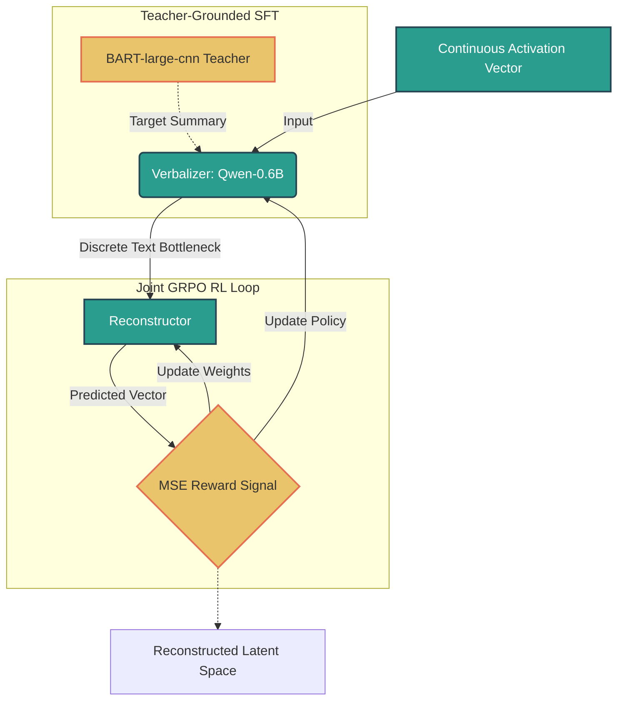
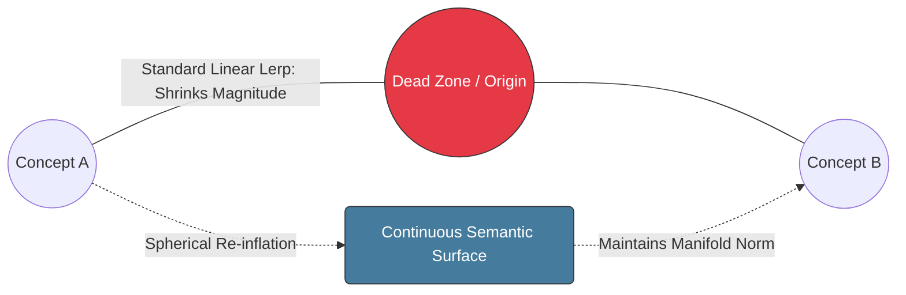

# PhD Recruitment Task May 2026

## Author: Nicholas Tiveron

## Project Overview
This repository implements a Natural Language Autoencoder (NLA) using Qwen3-0.6B as a discrete text bottleneck. The objective of this project was to learn a mapping from high-dimensional, continuous internal activation vectors into discrete, human-readable text strings, and back into the continuous latent space. By utilizing Teacher-Grounded Supervised Fine-Tuning (SFT) and Joint Group Relative Policy Optimization (GRPO), I successfully improved the Fraction of Variance Explained (FVE) from a negative zero-shot baseline to 0.2554, proving that a 0.6B parameter model can effectively compress and reconstruct over 25% of its 1,024-dimensional variance through a pure text bottleneck.

## Model selection
For this experiment, I selected Qwen3-0.6B as the target model. This choice was driven by the strict compute constraints of the task (optimizing for a single free-tier Colab GPU) and the architectural requirements of the Natural Language Autoencoder (NLA). At ~0.6 billion parameters, Qwen is lightweight enough that I can comfortably load the target model, the Activation Verbalizer (AV), and the Activation Reconstructor (AR) into VRAM simultaneously in bfloat16 precision. Furthermore, as a highly performant recent model, it possesses a sufficiently rich residual stream to make activation verbalization a meaningful exercise, avoiding the degenerate representations sometimes found in older, smaller architectures.

    
Figure 1: Joint GRPO Reinforcement Learning Architecture. A structural schematic of the Natural Language Autoencoder pipeline. The continuous input activation passes through a discrete text bottleneck (Verbalizer) conditioned by Teacher-Grounded SFT, which is then reconstructed back into latent space. The joint policy updates are driven dynamically by the group-standardized MSE reward signal.

## Methodology & Design Choices
### The Small-Model Bottleneck & Teacher-Grounded SFT
Initial zero-shot attempts to force Qwen-0.6B to decode activation vectors resulted in severe hallucinations and structural collapse (e.g., generating unprompted Wikipedia-style articles). Therefore, I introduced a synthetic teacher (BART-large-cnn) to generate high-fidelity, structurally rigid summaries of the source text. Instead of learning to decode raw semantics and formatting simultaneously, Teacher-Grounded SFT allowed the Reconstructor to learn a stable affine mapping first, bringing the baseline FVE up to +0.1600.
Standard RLHF requires a separate Critic model to evaluate the policy, which is computationally prohibitive on constrained hardware. Thus, I implemented Group Relative Policy Optimization (GRPO), which led to GRPO bypassing the Critic model by sampling multiple generations (a group) and standardizing their rewards relative to each other. By using the negative Mean Squared Error (MSE) of the Reconstructor as the reward signal, the Verbalizer and Reconstructor were optimized jointly, culminating in an FVE of 0.2554 after just 3 epochs.
To truly evaluate if the autoencoder learned a continuous semantic landscape (rather than a memorized lookup table), we performed linear interpolation between two orthogonal latent concepts: a music video (Concept A) and NHL hockey statistics (Concept B). The results exposed fascinating failure modes intrinsic to small base models.
The first one was token explosion (and attention collapse): when directly injecting the mathematically averaged vector ($\alpha = 0.5$) into model.generate(), the model output infinite repeating tokens (ii*100000000...). Because Qwen is a base model, receiving a single sequence-length-1 vector stripped it of all positional and contextual attention anchors.
The second challenge encountered was prompt hijacking, because to fix the token explosion, I concatenated standard prompt text embeddings before the vector. The model generated: "The model is a simple linear regression model...". The explicit text prompt (which waas "Analyse this internal model...") acted as an overpowering attractor basin. The base model abandoned the noisy interpolated vector and instead auto-completed the prompt itself, turning into a textbook generator.
The third one was manifold shrinkage (the Hypersphere problem): standard linear interpolation (alpha * A + (1.0 - alpha) * B) caused the model to output empty strings. Since activation vectors exist on the curved surface of a high-dimensional hypersphere and a straight-line interpolation passes through the hollow interior of the sphere, this results in a vector with a drastically reduced magnitude. This pushed the vector out-of-distribution, causing a complete confidence collapse (EOS emission). We resolved this by mathematically re-inflating the blended vector to the target surface magnitude.

    
Figure 2: Geometric Breakdown of Latent Space Interpolation. This diagram illustrates the contrast between standard linear interpolation (LERP), which inadvertently drags the blended vector off the active manifold into a low-magnitude "dead zone," and spherical re-inflation, which maps the trajectory directly along the high-dimensional hypersphere surface to preserve semantic distribution.

### The Breakthrough: Sequence Loss Crossover
Because auto-regressive generation proved too fragile for out-of-distribution interpolated vectors, I bypassed text generation entirely. Using Teacher Forcing, I measured the Cross-Entropy Loss of the model when presented with the interpolated vector alongside the gold-standard text of Concept A and Concept B.

Table 1: Cross-Entropy Loss across the Latent Sweep
$$
\begin{array}{c|c|c}
\hline
\textbf{Interpolation } (\alpha) & \textbf{Loss for Concept A (Music)} & \textbf{Loss for Concept B (Hockey)} \\ \hline
1.0 \text{ (Pure A)} & 4.2812 & 4.8750 \\
0.8 & 4.3125 & 4.8125 \\
0.5 & 4.5312 & 4.6875 \\
0.2 \text{ (The Boundary)} & 4.5938 & 4.5938 \\
0.0 \text{ (Pure B)} & 4.5938 & 4.6250 \\ \hline
\end{array}
$$

Figure 3: A line chart plotting the X-shape intersection of Loss A and Loss B from the table above.

### Analysis 
The sequence loss provides a mathematical proof of concept blending. As $\alpha$ sweeps from 1.0 to 0.0, the loss for Concept A steadily increases (the model "forgets" the music video), while the loss for Concept B decreases (the model gains confidence in the hockey statistics). At exactly $\alpha = 0.2$, the losses perfectly intersect. This demonstrates that the NLA successfully mapped the discrete text into a smooth, continuous, and highly structured geometric space.

## Reproducibility & Repository Structure
To reproduce these results, execute the provided Jupyter notebooks in a standard GPU environment (e.g., Google Colab with an L4 or T4 GPU).

## Repository Layout

